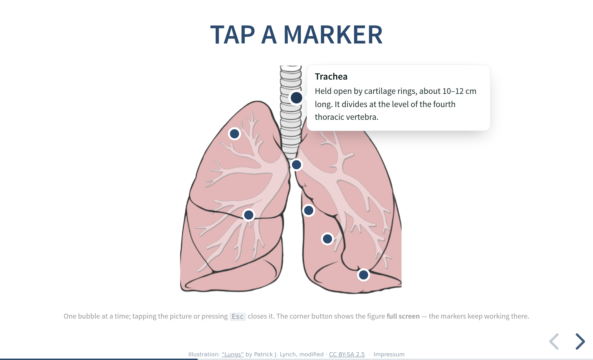

# Reveal - Hotspot

Annotate an image in place. Small markers sit on the picture; a tap opens name
and explanation right next to them, the next tap closes it. No quiz, no score,
no modes — you show a picture, you point at things, people read.

[](https://florianloyns.github.io/reveal.js-hotspot/demo.html)

**[Live demo](https://florianloyns.github.io/reveal.js-hotspot/demo.html)**

Marker positions are **percentages of the image**, so the plugin never measures
anything at runtime. That single decision is what makes it dependable: it does
not care whether the slide was still hidden when the deck loaded, what the
projector resolution is, or whether the reveal zoom plugin has scaled the page.

## Why

Every presentation tool can put a picture on a slide. What none of them do well
is the moment after: naming the parts of that picture while you talk about them.
The usual workarounds are a list of terms beside the image — leaving the audience
to match words to places — or arrows drawn on top, which turn every correction
into redrawing.

Three more things are unusual for a reveal plugin:

**It has its own full screen.** A wound photo or an anatomy drawing deserves the
whole wall — and generic image lightboxes load the bare image file, losing the
markers. Here the entire container moves into a dialog that looks exactly like
the Multimodal one (same backdrop, border, shadow and zoom-in), so the two do
not clash in one deck — but the markers keep working.

**Printing produces a real handout.** In `?print-pdf` the numbered image prints
on its slide and the full legend lands on a page of its own. Without that, a
printed slide is a picture with dots on it and no text at all.

**It is built for touch.** The visible dot is 18 px, the hit area is 48 px, and
because the markers live inside `.slides` they scale with the deck. Pointer
events, no hover dependency, and `data-prevent-swipe` so a swipe across the
picture does not advance the slide.

## Installation

Copy the `plugin/hotspot` folder into your presentation, or install it:

```sh
npm install reveal.js-hotspot
```

## Setup

The plugin brings its own CSS — there is no stylesheet to link.

### Regular

```html
<script src="dist/reveal.js"></script>
<script src="plugin/hotspot/hotspot.js"></script>
<script>
  Reveal.initialize({
    plugins: [ RevealHotspot ]
  });
</script>
```

### As a module

```html
<script type="module">
  import Reveal from './dist/reveal.esm.js';
  import RevealHotspot from './plugin/hotspot/hotspot.esm.js';
  Reveal.initialize({
    plugins: [ RevealHotspot ]
  });
</script>
```

## Usage

A container, an image, one `<span>` per marker:

```html
<figure class="hotspot">
  

  <span data-x="50" data-y="15" data-label="Trachea">
    Held open by cartilage rings, about 10–12 cm long.
  </span>

  <span data-x="50" data-y="43" data-label="Main bronchi">
    The right one leaves at a steeper angle — aspirated material
    usually ends up in the right lung.
  </span>
</figure>
```

- `data-x` and `data-y` are percentages of the image, `0`–`100`. One decimal is plenty.
- `data-label` is required — it is the heading of the bubble and the accessible
  name of the marker. The explanation is the content of the `<span>` and may
  contain markup; it is **moved**, not copied, so links and emphasis survive.
- `data-side="l|r|u|d"` overrides the automatic bubble placement — useful when
  two bubbles would collide.
- Instead of `` the first child may be an inline `<svg>`, a `<picture>` or a `<video>`.
- A marker that is missing a label or has coordinates outside `0–100` is skipped,
  with a warning in the console.

One bubble is open at a time; tapping another marker, the picture, or pressing
<kbd>Esc</kbd> closes it, as does leaving the slide. `data-multiple` (or the
global `multiple` option) lets several bubbles stay open at once.

### Numbers

`data-numbers` (or the global `numbers` option) numbers all markers — useful for
pointing: “look at number three”. Printing always numbers them.

### Revealing markers one by one

A marker carrying `class="fragment"` becomes a **native reveal fragment**. It
works with the remote, the speaker view and the URL — nothing is reimplemented:

```html
<span class="fragment" data-x="50" data-y="15" data-label="Trachea">…</span>
```

Fragment classes such as `fade-in-then-out` and `data-fragment-index` are carried
over as well.

### Image size

Default maximum width is 760 px, relative to the configured deck width. Per
container:

```html
<figure class="hotspot" data-width="900px"> … </figure>
```

## Full screen

Every figure gets a small button in its corner — the same expand symbol the
`zoombild` links use — that shows the picture **full screen**. This is not a
lightbox that loads the image again: the entire container moves into a
multimodal-style dialog, so the markers simply keep working there. <kbd>Esc</kbd>
or a tap on the backdrop brings the slide back; slide navigation is blocked
while the dialog is open, and small images are scaled up to the viewport.
Disable it per figure with `data-maximize="off"` or globally with
`maximize: false`.

## Placing markers

Typing percentages by hand is tedious. Turn on the author mode and the plugin
hands you the finished markup:

```js
Reveal.initialize({ hotspot: { author: true }, plugins: [ RevealHotspot ] });
```

Every `.hotspot` gets a dashed outline. Click anywhere on the picture and a
snippet with the coordinates already filled in is copied to your clipboard:

```html
<span data-x="41.8" data-y="62.3" data-label="Label">Text</span>
```

Keep this **off** for teaching — it is an authoring aid, not a feature.

## Printing

Open the deck with `?print-pdf` and print from there — that is reveal's own
print view, and the plugin builds on it. The numbered picture prints on its
slide, and the full legend — every number with its label and text — lands on a
**page of its own**, right after it. Nothing is cut off:

- The picture is capped to the height of one sheet (`58vh`), so image and
  heading always fit a single page. The markers keep their positions because
  they are percentages of the image.
- The legend becomes its own reveal slide, so reveal paginates it natively — a
  long legend simply flows onto a second sheet instead of being clipped. These
  extra slides exist **only** under `?print-pdf`; the on-screen talk never gets
  them.

Fragment markers are forced visible for the print, so a step-by-step slide still
shows all its dots. Bubbles and buttons are hidden. The on-slide legend is
`aria-hidden` so screen readers do not read every text twice.

## Configuration

All values are optional.

```js
Reveal.initialize({
  hotspot: {
    accent:    '#2C4A6E',   // marker colour
    active:    '#203A58',   // colour of the open marker
    surface:   '#FFFFFF',   // bubble background
    line:      '#E7EBEF',   // borders
    strong:    '#0B1818',   // label colour
    text:      '#22312F',   // explanation colour
    hit:        48,         // hit area in px
    dot:        18,         // visible dot in px
    ring:        4,         // white ring around the dot
    width:     760,         // maximum image width in px
    popWidth:  330,         // bubble width in px
    labelSize:  19,
    textSize:   17,
    radius:     12,         // image corner radius
    multiple: false,        // several bubbles open at once
    numbers:  false,        // number all markers
    author:   false,        // author mode
    maximize: true,         // full-screen button in the figure corner
    strings: {
      maximize: 'Bild groß zeigen',
      close:    'Schließen'
    }
  },
  plugins: [ RevealHotspot ]
});
```

`multiple`, `numbers`, `author` and `maximize` can be overridden per container
with `data-multiple`, `data-numbers`, `data-author` and `data-maximize="off"`.

## Notes

- Nothing is fetched at runtime. Coordinates and texts live in the markup, the
  picture comes through ``, so a deck opened straight from the file
  system works — no server, no CORS.
- Building is idempotent (`data-hotspot-ready`), and `RevealHotspot.rebuild()`
  picks up containers added later.
- The markers are real `<button>` elements: reachable with <kbd>Tab</kbd>,
  operable with <kbd>Enter</kbd> and <kbd>Space</kbd>, `aria-expanded` reflects
  the state, <kbd>Esc</kbd> closes.
- Tested against reveal.js 5 and 6, over `http` and over `file://`, together
  with the built-in zoom plugin.

## Credits

The lung illustration used in the demo (`medien/lungs.png`) is a modified
version of **“Lungs” by Patrick J. Lynch**, from Wikimedia Commons
([File:Birikak.png](https://commons.wikimedia.org/wiki/File:Birikak.png)),
licensed under
[CC BY-SA 2.5](https://creativecommons.org/licenses/by-sa/2.5/).
**Changes made:** the original background was removed / whitened so the image
could serve as an annotation canvas.

Because the licence is ShareAlike, this modified image is released under the
same licence,
[CC BY-SA 2.5](https://creativecommons.org/licenses/by-sa/2.5/). This applies
to the demo image only — the plugin code contains no third-party material and
stays under the MIT licence.

## Imprint

Responsible: Florian Loyns — [imprint & privacy notice](https://florianloyns.com/Impressum/) (German)

## License

MIT — see [LICENSE](LICENSE). Thanks to Hakim El Hattab (reveal.js).
